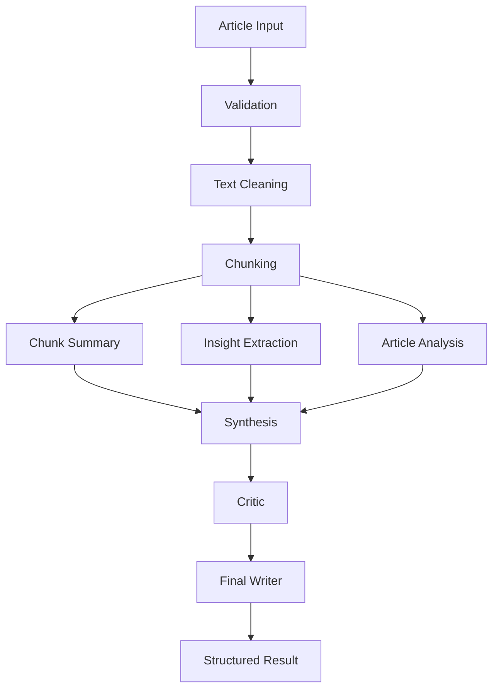

# AI Article Summarizer

A production-minded article summarization application built around a
**multi-stage LangChain pipeline** rather than a single prompt-to-summary
call. The pipeline analyzes an article, processes it in parallel chunks for
both summarization and analytical insight extraction, synthesizes a
coherent draft, critiques that draft against the source, and writes a
final structured summary - optionally revising once if the critic flags
issues.

## Project overview

- **Backend:** Python 3.12 / FastAPI / LangChain, exposing one primary
  endpoint (`POST /api/v1/summarize`).
- **Frontend:** React + Vite single-page app with a live pipeline-stage
  indicator and a structured, readable result view.
- **Core value:** the orchestrated multi-chain pipeline, not the UI or the
  API surface - see [Pipeline flow](#pipeline-flow).

## Architecture

Responsibilities are kept in separate layers:

```
PROMPTS  →  CHAIN DEFINITIONS  →  SERVICES  →  PIPELINE ORCHESTRATOR  →  API
```

- `app/prompts/` - prompt templates only, no LLM calls.
- `app/chains/` - one LangChain runnable per pipeline stage, each with
  structured (Pydantic) output.
- `app/services/` - text cleaning, chunking, URL loading, and the
  orchestrator (`pipeline.py`) that sequences everything. Contains no
  prompt strings.
- `app/api/` - FastAPI routes; translates HTTP requests into pipeline
  calls and pipeline results into HTTP responses.
- `app/llm/provider.py` - the only place a chat model is instantiated.

## Pipeline flow



Chunk summary and insight extraction run **concurrently per chunk**
(bounded by `MAX_CONCURRENCY`), and a single chunk failure is caught and
logged without failing the whole request - the synthesis stage works with
whatever chunk data succeeded.

The critic runs **at most one revision cycle**: if it returns `REVISE`,
its issues and recommendations are passed to the final writer to address
directly. There is no self-correction loop back to the critic.

## Tech stack

**Backend:** FastAPI, LangChain / LangChain Core, `langchain-openai`,
LangChain text splitters, Pydantic v2, `pydantic-settings`, `python-dotenv`,
`httpx`, `pytest` + `pytest-asyncio`.

**Frontend:** React 18, Vite 5, hand-written CSS (no framework) using a
small design-token system.

**Observability:** optional LangSmith tracing, enabled purely through
environment variables.

## Setup

### Backend setup

```bash
cd backend
python3 -m venv .venv
source .venv/bin/activate      # Windows: .venv\Scripts\activate
pip install -r requirements.txt
cp .env.example .env
# then edit .env and set OPENAI_API_KEY
```

### Frontend setup

```bash
cd frontend
npm install
```

## How to run

Backend (from `backend/`, with the venv active):

```bash
uvicorn app.main:app --reload --port 8000
```

Frontend (from `frontend/`, in a second terminal):

```bash
npm run dev
```

Open `http://localhost:5173`. The Vite dev server proxies `/api/*` to
`http://127.0.0.1:8000` (see `frontend/vite.config.js`).

## Environment variables

Defined in `backend/.env.example`:

| Variable | Default | Purpose |
|---|---|---|
| `OPENAI_API_KEY` | *(none)* | **Required.** Auth for the OpenAI-compatible chat model. |
| `OPENAI_MODEL` | `gpt-4o-mini` | Model name passed to `ChatOpenAI`. |
| `OPENAI_BASE_URL` | *(none)* | Optional. Point at any OpenAI-compatible endpoint. |
| `TEMPERATURE` | `0` | Default sampling temperature. |
| `LLM_REQUEST_TIMEOUT` | `60` | Per-request timeout (seconds). |
| `LLM_MAX_RETRIES` | `2` | Retries on transient LLM errors. |
| `CHUNK_SIZE` | `4000` | Characters per chunk. |
| `CHUNK_OVERLAP` | `400` | Character overlap between chunks. |
| `MAX_CONCURRENCY` | `4` | Max simultaneous chunk-processing tasks. |
| `MIN_ARTICLE_WORDS` | `40` | Minimum accepted article length. |
| `MAX_ARTICLE_CHARS` | `200000` | Maximum accepted article length. |
| `URL_FETCH_TIMEOUT` | `10` | Timeout for optional URL loading. |
| `LANGSMITH_API_KEY` / `LANGSMITH_TRACING` / `LANGSMITH_PROJECT` | *(unset)* | Optional tracing. |
| `CORS_ALLOW_ORIGINS` | `http://localhost:5173,...` | Comma-separated allowed origins. |
| `LOG_LEVEL` | `INFO` | Python logging level. |

## API endpoints

### `POST /api/v1/summarize`

**Request:**

```json
{
  "article": "Full article text...",
  "summary_length": "medium"
}
```

`summary_length` is one of `short`, `medium`, `detailed`. Instead of
`article`, you may send `url` and the backend will attempt to fetch and
extract article text from it (best-effort - see
[Limitations](#limitations-that-remain)).

**Response:**

```json
{
  "title": "Example Title",
  "summary": "A coherent, grounded summary of the article...",
  "key_points": ["Point one", "Point two"],
  "main_argument": "The article argues that...",
  "important_facts": ["Fact one", "Fact two"],
  "conclusion": "The article concludes that...",
  "word_count": 312,
  "metadata": {
    "input_words": 4200,
    "chunk_count": 4,
    "revised": false,
    "duration_seconds": 8.4
  }
}
```

Errors are returned as `{"detail": "human-readable message"}` with
`400` for invalid input and `502` if the AI service fails - internal stack
traces are never exposed.

### `GET /api/v1/health`

Simple liveness check, returns `{"status": "ok"}`.

## Testing

From `backend/`:

```bash
pytest                                                   # no API key needed
OPENAI_API_KEY=sk-... pytest tests/test_integration.py   # optional live test
```

75 tests run without credentials (plus 1 live test that is skipped unless
`OPENAI_API_KEY` is set). Beyond unit tests with mocked stages, the suite
runs the **real LangChain chains** (prompts -> `ChatOpenAI` -> structured
output parsing) against a local fake OpenAI-compatible server
(`tests/fake_openai.py`), so nothing is stubbed between the HTTP layer and
the wire. Covered: text cleaning, chunking, schemas, each chain's typed
output, prompt variable injection, stage order, multi-chunk fan-out,
chunk ordering when tasks finish out of order, the concurrency bound,
per-chunk failure tolerance, total-failure handling, the single revision
cycle, invalid input (no LLM call is made), size limits, clean 502s that
leak nothing, the URL loader (extraction, HTTP errors, timeouts, redirect
limits, SSRF blocking), CORS, LangSmith wiring and run names.

## LangSmith setup

```bash
LANGSMITH_TRACING=true
LANGSMITH_API_KEY=lsv2_...
LANGSMITH_PROJECT=ai-article-summarizer
```

Tracing is enabled only when both the flag and a key are set. Runs appear
named `article_analysis`, `chunk_summary`, `chunk_insights`, `synthesis`,
`critic` and `final_writer`.

## Project structure

```
ai-article-summarizer/
├── backend/
│   ├── app/
│   │   ├── api/routes.py
│   │   ├── chains/          # analysis, chunk_summary, insights,
│   │   │                    # synthesis, critic, final_writer
│   │   ├── prompts/         # one prompt module per chain
│   │   ├── services/        # text_cleaner, chunker, article_loader, pipeline
│   │   ├── schemas/         # article, analysis, result
│   │   ├── config/          # settings.py, tracing.py
│   │   ├── llm/provider.py
│   │   └── main.py
│   ├── tests/               # incl. fake_openai.py test server
│   ├── requirements.txt
│   ├── .env.example
│   └── README.md
├── frontend/
│   ├── src/
│   │   ├── components/      # ArticleInput, PipelineProgress, ResultDisplay
│   │   ├── pages/HomePage.jsx
│   │   ├── hooks/useSummarizePipeline.js
│   │   ├── types/summary.js
│   │   ├── services/api.js
│   │   ├── App.jsx / main.jsx / index.css
│   ├── package.json
│   └── README.md
├── .gitignore
└── README.md
```

## Important design decisions

- **Independent chunk chains, not one mega-prompt.** Summary and insight
  extraction are separate chains with separate prompts and separate
  Pydantic output shapes, so each can be tuned, tested, and traced
  independently, and both run in the same asyncio.gather per chunk.
- **Bounded concurrency.** An `asyncio.Semaphore(MAX_CONCURRENCY)` wraps
  chunk processing so a long article can't fan out into unbounded
  simultaneous LLM calls.
- **Per-chunk failure isolation.** `asyncio.gather(..., return_exceptions=True)`
  means one chunk's summary or insight call failing doesn't fail the whole
  request; the synthesis stage is told which chunks are missing data.
- **One writer, one provider module.** `app/llm/provider.py` is the only
  place `ChatOpenAI` is constructed, so swapping providers later is a
  one-file change.
- **Word count is computed, not trusted.** The final writer's `word_count`
  is recalculated from the actual generated summary text rather than
  relying on the model's self-reported count.
- **Maximum one revision cycle.** The critic never loops back on itself;
  its output is handed to the final writer once, by design (see spec
  section 17).
- **No database, no auth, no RAG in V1** - kept deliberately out of scope.

## Tests performed

- `pytest`: 75 passed, 1 skipped (the live-key integration test).
- Full stack run locally: fake OpenAI server -> real uvicorn backend with the
  real chains -> Vite dev server. Requests sent **through the Vite proxy**
  returned a correct 200 for a 6-chunk article (all stages logged in
  order) and clean 400/422 responses for invalid input.
- Real browser (Playwright/Chromium) against that stack: empty and
  too-short validation messages, happy path with the Detailed option, the
  7 pipeline stages rendering and completing, all result sections, Copy
  all, New article reset, a 390px mobile viewport with no horizontal
  overflow, and the error banner when the model endpoint is down (no
  internals shown; button re-enabled).
- `npm run build` succeeds.

## Limitations that genuinely remain

- **No call to the real OpenAI API was made.** The sandbox has no key or
  OpenAI network access. The chains are verified against a
  schema-faithful fake, but model *output quality* (summary faithfulness,
  word-count adherence to the length bands, critic strictness) is
  unverified. Run one real request with your key and try
  `tests/test_integration.py`.
- **Length bands are prompt-enforced only.** The final writer is asked for
  100-150 / 250-350 / 450-600 words but the code does not re-check or
  retry on a miss (`word_count` is measured and reported honestly).
- **The article is sent whole to the analysis and critic stages.** Articles
  near `MAX_ARTICLE_CHARS` (200k chars) can exceed some models' context
  windows; lower the limit or use a long-context model.
- **URL extraction is a lightweight heuristic** (strip script/style/nav,
  strip tags), not a readability algorithm; it will fail on JS-rendered or
  paywalled pages. It blocks non-public hosts (including via redirects).
  Pasted text is the primary, reliable workflow.
- **Pipeline stage display is simulated on a timer.** The backend returns
  one response at the end; real per-stage progress needs a streaming
  endpoint (SSE).
- **No persistence, auth or rate limiting** (out of scope for V1; put a
  rate limiter in front before exposing publicly, since each request makes
  several paid LLM calls).

## Future improvements

- Stream real per-stage progress (SSE) instead of a simulated timer.
- A proper readability/extraction library for URL loading.
- Response caching for identical article + length requests.
- Swap-in a second LLM provider via `app/llm/provider.py` to compare
  quality/cost.
- Persist run history (would introduce a database - explicitly out of
  scope for V1).
# Ai-Summariser

